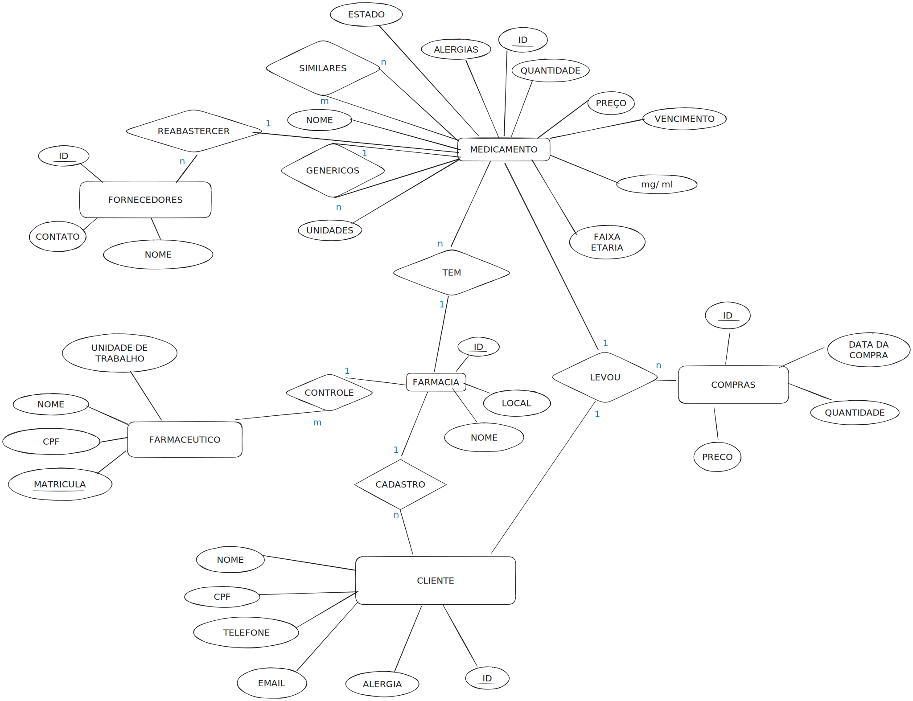

# API de Farmácia

Este projeto consiste na produção de uma API para gerenciar operações de uma farmácia, fornecendo endpoints para manipulação de medicamentos, funcionários, clientes, fornecedores e compras. Para isso, foi escolhido o uso do framework FastAPI.

## Modelos de Entidade e Relacionamento

A estrutura de dados do projeto é definida por meio de modelos de entidade e relacionamento. Abaixo está uma representação simplificada dos modelos:

#### Fornecedores

Representa informações dos fornecedores que fornecem produtos para a farmácia.

| Atributo       | Tipo     | Descrição                                               |
| -------------- | -------- | ------------------------------------------------------- |
| `id`           | `int`    | Identificador único do fornecedor                        |
| `nome`         | `str`    | Nome do fornecedor                                      |
| `contato`      | `str`    | Informações de contato do fornecedor                     |
| `medicamento_id`  | `int`    | ID do medicamento relacionada ao fornecedor (opcional, chave estrangeira) |

#### Farmácia

Representa informações da própria farmácia.

| Atributo   | Tipo     | Descrição                         |
| ---------- | -------- | --------------------------------- |
| `id`       | `int`    | Identificador único da farmácia   |
| `nome`     | `str`    | Nome da farmácia                  |
| `local`    | `str`    | Localização da farmácia           |

#### Funcionário

Representa informações dos funcionários que trabalham na farmácia.

| Atributo            | Tipo     | Descrição                                               |
| ------------------- | -------- | ------------------------------------------------------- |
| `matricula`         | `int`    | Número de matrícula do funcionário                       |
| `p_nome`            | `str`    | Primeiro nome do funcionário                             |
| `u_nome`            | `str`    | Último nome do funcionário (opcional)                    |
| `cpf`               | `str`    | Número de CPF do funcionário                             |
| `unidade_trabalho`  | `str`    | Unidade de trabalho do funcionário (opcional)            |
| `controle_farmacia` | `int`    | ID da farmácia que o funcionário gerencia (opcional, chave estrangeira) |

#### Cliente

Representa informações dos clientes que utilizam a farmácia para realizar compras de medicamentos e produtos diversos.

| Atributo            | Tipo     | Descrição                                             |
| ------------------- | -------- | ----------------------------------------------------- |
| `id`                | `int`    | Identificador único do cliente                         |
| `nome`              | `str`    | Nome completo do cliente                               |
| `cpf`               | `str`    | Número de CPF do cliente                              |
| `telefone`          | `str`    | Número de telefone do cliente                         |
| `email`             | `str`    | Endereço de e-mail do cliente (opcional)               |
| `alergias`          | `str`    | Informações sobre alergias do cliente (opcional)       |
| `cadastro_farmacia` | `int`    | ID da farmácia associada ao cliente (opcional, chave estrangeira) |
| `forma_pagamento`   | `str`    | Método preferido de pagamento do cliente (opcional)    |

#### Medicamento

Representa informações sobre os medicamentos disponíveis na farmácia.

| Atributo          | Tipo     | Descrição                                             |
| ----------------- | -------- | ----------------------------------------------------- |
| `id`              | `int`    | Identificador único do medicamento                     |
| `vencimento`      | `date`   | Data de vencimento do medicamento (opcional)           |
| `preco`           | `float`  | Preço do medicamento                                  |
| `alergias`        | `str`    | Alergias relacionadas ao medicamento (opcional)       |
| `quantidade`      | `int`    | Quantidade disponível do medicamento (opcional)        |
| `faixa_etaria`    | `str`    | Faixa etária recomendada para o medicamento (opcional) |
| `mg_ml`           | `str`    | Miligramas por mililitro do medicamento (opcional)    |
| `unidade`         | `str`    | Unidade de medida do medicamento (opcional)            |
| `nome`            | `str`    | Nome do medicamento                                   |
| `farmacia_id`     | `int`    | ID da farmácia associada ao medicamento (opcional, chave estrangeira)     |
| `similares`     | `int`    | ID de medicamento simulares ao associado (opcional, chave estrangeira)     |
| `genericos`     | `int`    | ID de medicamento generico (opcional, chave estrangeira)     |
| `reabatecer`     | `int`    | ID do fornecedor do medicamento associado  (opcional, chave estrangeira)     |

#### Compra

Representa informações sobre as compras realizadas na farmácia.

| Atributo         | Tipo     | Descrição                                   |
| ---------------- | -------- | ------------------------------------------- |
| `id`             | `int`    | Identificador único da compra                |
| `cliente_id`     | `int`    | ID do cliente que realizou a compra(Chaves estrangeiras)          |
| `medicamento_id` | `int`    | ID do medicamento comprado (Chaves estrangeiras)                  |
| `data_compra`    | `date`   | Data em que a compra foi realizada           |
| `quantidade`     | `int`    | Quantidade de medicamento comprada           |
| `preco_total`    | `float`  | Preço total da compra                        |

### Modelo de Relacionamento:

- Medicamento está associado a uma Farmácia
- Funcionário tem relação com uma Farmácia
- Cliente está vinculado a uma Farmácia
- Medicamento pode ter relação com Fornecedores, Clientes e Farmácia
- Compra está relacionada a Cliente e Medicamento

## Instalação

Para utilizar esta API, siga estes passos:

1. Clone este repositório.
2. Instale as dependências com `pip install -r requirements.txt`.
3. Execute o arquivo `py .\main.py`